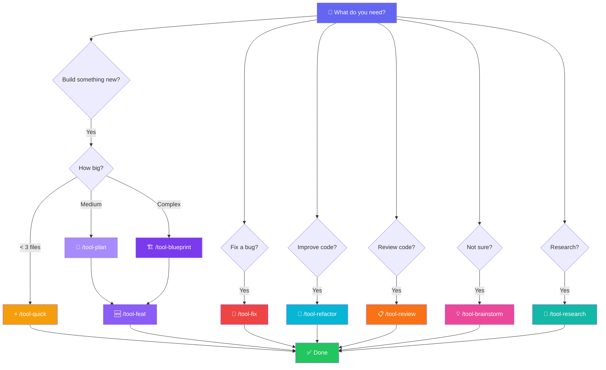

<p align="center">
  
  
  
  
</p>

<h1 align="center">🪖 Engineer Shovel</h1>

<p align="center">
  <b>All-in-one AI agent development toolkit</b><br>
  <sub>New Feature · Bug Fix · Brainstorming · Refactoring · Code Review · Quick Tasks · Complex Projects · Deep Research</sub>
</p>

<p align="center">
  <code>/tool-feat</code> <code>/tool-fix</code> <code>/tool-plan</code> <code>/tool-refactor</code> <code>/tool-review</code> <code>/tool-brainstorm</code> <code>/tool-quick</code> <code>/tool-blueprint</code> <code>/tool-research</code>
</p>

<p align="center">
  <a href="#-quick-start">Quick Start</a> •
  <a href="#-commands--workflows">Commands</a> •
  <a href="#-toolchain">Toolchain</a> •
  <a href="README_zh.md">中文</a>
</p>

<p align="center">
  <code>skill(name="engineer-shovel")</code>
</p>

---

## 📖 What is this?

**Engineer Shovel** — like a real entrenching tool, it serves as a shovel, pickaxe, saw, and ruler all in one. Encapsulates the best practices of the full development toolchain into **9 standalone slash commands**, covering the entire development lifecycle.

```
OpenCode   + superpowers + ecc + gsd + omo + Caveman + rtk
Claude Code + superpowers + ecc + gsd      + Caveman + rtk
```

Each command is a complete workflow — from planning to verification, from bug fix to release.

---

## 🧭 Task Router



---

## 🚀 Quick Start

**New user? One command setup:**

```bash
curl -fsSL https://raw.githubusercontent.com/HunterXing/engineer-shovel/main/install.sh | bash
```

This auto-installs **ECC**, **GSD**, **superpowers**, **Caveman**, **RTK** and the `engineer-shovel` skill.

**In session:**

```
skill(name="engineer-shovel")
```

Then pick your scenario — each `/tool-*` command has the full workflow.

---

## 🌟 Features

| Category | Description |
|----------|------------|
| 🎯 **9 Commands** | New Feature, Bug Fix, Planning, Refactoring, Code Review, Brainstorming, Quick Tasks, Complex Projects, Deep Research |
| 🔀 **Dual Environment** | Explicit `[OC]` / `[CC]` command branching |
| 🧭 **Decision Trees** | Primary router + complexity router |
| 🛠️ **Self-Contained** | Each command file has env-aware steps, ready to execute |
| ⚡ **Token Mgmt** | Caveman lite/full/ultra + context preservation |
| 🌐 **Lang Reference** | Test / Build / Review for 10 languages |
| 📋 **Quick Lookup** | 9-scenario command summary |

---

## 📋 Commands & Workflows

| Command | Scenario | Pipeline |
|---------|----------|----------|
| `/tool-feat` | 🆕 New Feature | `/plan` → `/prp-implement` → `/verify` → commit |
| `/tool-fix` | 🐛 Bug Fix | `/gsd-debug` → fix → test → commit |
| `/tool-plan` | 📐 Planning | `/plan` / `/blueprint` → review → execute |
| `/tool-refactor` | 🔧 Refactoring | `/refactor` → verify → `/review-work` → commit |
| `/tool-review` | 📋 Code Review | `/code-review` / `/review-pr` / `/review-work` |
| `/tool-brainstorm` | 💡 Brainstorming | `/gsd-explore` / `/superpowers:brainstorming` |
| `/tool-quick` | ⚡ Quick Tasks | `/gsd-fast` / cavecrew builder |
| `/tool-blueprint` | 🏗️ Complex Projects | `/blueprint` / GSD phases → `/gsd-ship` |
| `/tool-research` | 🔬 Deep Research | `/deep-research` → synthesize → apply |

> Each `commands/tool-*.md` is self-contained — env-aware steps with OpenCode `[OC]` and Claude Code `[CC]` variants.

---

## 🔧 Toolchain

| Tool | Purpose | Install |
|------|---------|---------|
| **ECC** | Plugin & skill framework | `/plugin install ecc@ecc` |
| **GSD** | Project management | Part of ECC |
| **superpowers** | Brainstorming & planning | `/plugin install superpowers@claude-plugins-official` |
| **Caveman** | Token compression | `/plugin install caveman@caveman` |
| **RTK** | CLI token optimization | `cargo install rtk` |

---

## 📂 Structure

```
engineer-shovel/
├── commands/          # 9 standalone slash commands
├── SKILL.md           # Main skill (700+ lines)
├── install.sh         # One-command bootstrap installer
├── README.md          # English docs (this file)
├── README_zh.md       # Chinese docs
└── LICENSE            # MIT
```

---

## 📝 License

MIT — see [LICENSE](LICENSE)

<p align="center">
  <sub>Built for OpenCode + superpowers + ecc + gsd + omo + Caveman + rtk</sub>
</p>
