# Global Mode Routing

Engineer Shovel 的真实路由不是只有“先选命令”，而是两层判断同时生效：

1. 先按任务类型选择命令
2. 再按风险、复杂度、验证成本选择模式

也就是：

```text
任务类型 -> 命令入口 -> 成本模式 -> 具体工作流 -> 是否升级到外部能力层
```

这份文档从 `--fast / --standard / --deep` 的统一视角，梳理 10 个活跃命令到底会走什么路径。

---

## 一张总图

```mermaid
flowchart TD
    A[收到任务] --> B{先选命令}

    B --> Q[tool-quick]
    B --> F[tool-fix]
    B --> FEAT[tool-feat]
    B --> P[tool-plan]
    B --> R[tool-review]
    B --> RF[tool-refactor]
    B --> RS[tool-research]
    B --> BR[tool-branch]
    B --> G[tool-graph]
    B --> U[tool-update]

    Q --> QM{模式}
    F --> FM{模式}
    FEAT --> FEM{模式}
    P --> PM{模式}
    R --> RM{模式}
    RF --> RFM{模式}
    RS --> RSM{模式}

    QM --> QF[fast: 直接改 -> 最近验证]
    QM --> QS[standard: 少量 graph -> 小改 -> 验证]

    FM --> FF[fast: 已知根因 -> 直接修]
    FM --> FS[standard: 复现 -> trace -> 修复 -> 回归]
    FM --> FD[deep: 跨模块/根因不清 -> 方法层升级]

    FEM --> FEF[fast: 小功能切片]
    FEM --> FES[standard: 找现有模式 -> 实现 -> 测试 -> light review]
    FEM --> FED[deep: 模糊/多系统 -> OpenSpec or ECC or GSD]

    PM --> PF[fast: 短计划]
    PM --> PS[standard: 普通实现计划]
    PM --> PD[deep: spec/file-backed plan/milestone]

    RM --> RFa[fast: sanity review]
    RM --> RSa[standard: normal diff or PR review]
    RM --> RDa[deep: 大改动/安全/交付前总审查]

    RFM --> RFF[fast: 小范围重构]
    RFM --> RFS[standard: baseline -> 小步重构 -> 每步验证]
    RFM --> RFD[deep: 先 plan deep 再重构]

    RSM --> RSF[quick: 本地上下文研究]
    RSM --> RSS[web: 官方文档/当前信息]
    RSM --> RSD[deep: 架构与策略研究]

    BR --> BR1[平台命令: create/status/review/merge/abort]
    G --> G1[平台命令: status/build/update/rebuild/watch]
    U --> U1[平台命令: check/full]
```

---

## 模式定义

| 模式 | 目标 | 默认动作 | 不该默认进入 |
|---|---|---|---|
| `--fast` | 最低成本闭环 | 少上下文、少文件、最近验证 | OpenSpec、GSD、深度研究、重审查 |
| `--standard` | 正常工程主路径 | 定向 graph、原生测试/构建、必要时轻审查 | 无证据时直接进入重编排 |
| `--deep` | 处理高风险、多阶段、不确定问题 | 更强方法层、规格层、编排层、跨会话控制 | 把 routine coding 伪装成 deep |

补充约束：

- `--fast` 主要追求“做对并尽快证明”
- `--standard` 是默认主路径，不应天然很重
- `--deep` 不是“更认真一点的 standard”，而是工作流层级真的升级

---

## `--fast` 全局路径

### 适用信号

- 目标明确
- 影响面小
- 修改文件少
- 验证路径清楚
- 不需要持久化 spec 或阶段编排

### 全局工作流

```text
明确任务 -> 定位文件/符号 -> 最小改动 -> 最近验证 -> 结束
```

### 命令映射

| 命令 | `--fast` 路由 |
|---|---|
| `tool-quick` | 直接修改 -> 最近验证 |
| `tool-fix` | 已知根因 -> 直接修复 -> 跑目标测试 |
| `tool-feat` | 已知区域的小功能切片 -> 实现 -> 目标验证 |
| `tool-plan` | 输出短计划 -> 回流到 `quick` 或 `feat` |
| `tool-review` | 小 diff sanity check |
| `tool-refactor` | 1-2 文件清理 -> baseline -> verify |
| `tool-research` | 不走 `fast`，对应的是 `--quick` |
| `tool-branch` | 不按成本模式分流 |
| `tool-graph` | 不按成本模式分流 |
| `tool-update` | 不按成本模式分流 |

### 工具使用倾向

- `caveman lite`
- `code-review-graph` 只在目标文件/影响面不够清楚时使用
- `rtk` 只包大输出
- 不进入 `OpenSpec`
- 不进入 `GSD`

---

## `--standard` 全局路径

### 适用信号

- 正常开发任务
- 需要一点上下文才能做对
- 需要项目原生验证
- 可能需要轻审查，但还不到 milestone 级别

### 全局工作流

```text
定向 graph 上下文 -> 复用现有模式 -> 实现最小可验证切片 -> 原生测试/构建 -> 轻审查 -> 结束
```

### 命令映射

| 命令 | `--standard` 路由 |
|---|---|
| `tool-quick` | 小范围 graph -> 小改 -> 测试/构建 |
| `tool-fix` | 复现 -> trace/impact -> 修复 -> failing test first -> regression |
| `tool-feat` | graph 找现有模式 -> 实现最小切片 -> 测试/构建 -> `tool-review --fast` |
| `tool-plan` | 影响分析 -> 验证标准 -> 普通实现计划 |
| `tool-review` | `detect_changes` -> `get_review_context` -> normal review |
| `tool-refactor` | baseline -> 小步重构 -> 每步验证 -> local review |
| `tool-research` | 不走 `standard`，对应的是 `--web` 或本地 `--quick` |
| `tool-branch` | 不按成本模式分流 |
| `tool-graph` | 不按成本模式分流 |
| `tool-update` | 不按成本模式分流 |

### 工具使用倾向

- `caveman full`
- `code-review-graph` 是默认代码理解层
- `rtk gain` 处理大型测试、构建和日志
- `superpowers` 只在单任务方法卡住时引入
- `OpenSpec` 只在验收必须沉淀成持久工件时引入
- 一般不进 `GSD`

---

## `--deep` 全局路径

### 适用信号

- 需求模糊且需要多轮澄清
- 跨模块、跨系统、跨阶段
- 根因不清、回归面大、需要更强验证
- 需要 durable spec、milestone、handoff、cross-session orchestration

### 全局工作流

```text
澄清/研究 -> 架构与影响分析 -> 规格或计划固化 -> 分阶段实现 -> 扩展验证 -> 深审查/交付
```

### 命令映射

| 命令 | `--deep` 路由 |
|---|---|
| `tool-quick` | 不支持，复杂了就换命令 |
| `tool-fix` | 跨模块/安全/根因不清 -> 方法层升级 -> verify/review/ship |
| `tool-feat` | Phase 0 澄清 -> OpenSpec/ECC/GSD 按需进入 -> verify/review/ship |
| `tool-plan` | spec/file-backed plan/milestone 级规划 |
| `tool-review` | 大改动、安全敏感、交付前总审查 |
| `tool-refactor` | 先 `tool-plan --deep`，再进入重构 |
| `tool-research` | 深研究、架构权衡、冲突证据整合 |
| `tool-branch` | 不按成本模式分流 |
| `tool-graph` | 不按成本模式分流 |
| `tool-update` | 不按成本模式分流 |

### 工具使用倾向

- `caveman full`，必要时 `ultra`
- `code-review-graph` 做 architecture/impact/review context
- `superpowers` 用于单任务调试、规划、方法升级
- `ECC` 用于 specialized research、architecture tradeoff、安全与能力包
- `OpenSpec` 用于 durable spec / task artifacts
- `GSD` 用于 milestone、多阶段、跨会话执行

---

## 哪些命令不属于三档模式体系

这 3 个平台命令不应强行套入 `--fast / --standard / --deep`：

| 命令 | 实际分流方式 |
|---|---|
| `tool-branch` | `create / status / review / merge / abort` |
| `tool-graph` | `status / build / update / rebuild / watch` |
| `tool-update` | `--check / --full` |

原因很简单：

- 它们是平台生命周期操作，不是日常编码任务
- 它们更适合按“动作类型”或“维护强度”分流，而不是按成本模式分流

---

## 命令与模式的全局矩阵

| 命令 | `--fast` | `--standard` | `--deep` | 备注 |
|---|---|---|---|---|
| `tool-quick` | yes | yes | no | 复杂了就换命令 |
| `tool-fix` | yes | yes | yes | 典型三档命令 |
| `tool-feat` | yes | yes | yes | 典型三档命令 |
| `tool-plan` | yes | yes | yes | `--deep` 才进入更重规划 |
| `tool-review` | yes | yes | yes | 审查强度递增 |
| `tool-refactor` | yes | yes | yes | `--deep` 先规划再动手 |
| `tool-research` | no | no | yes | 实际是 `--quick / --web / --deep` |
| `tool-branch` | no | no | no | 平台命令 |
| `tool-graph` | no | no | no | 平台命令 |
| `tool-update` | no | no | no | 平台命令 |

---

## 主命令内部分流小图

下面这 4 张图把主工作流命令再下沉一层，直接回答“进入命令后，模式如何改变内部路径”。

### `tool-quick`

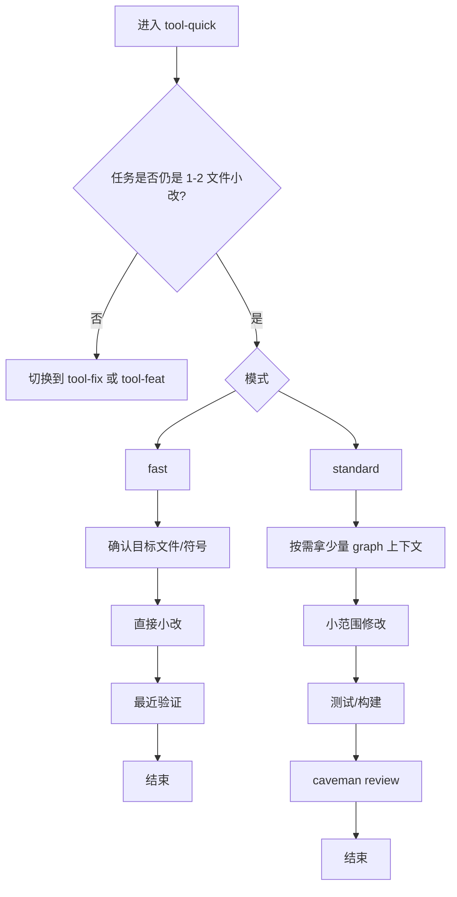

路径说明：

- `--fast`：目标已经很清楚，追求最低成本闭环
- `--standard`：需要少量上下文和验证，但仍然是“小任务”
- 不支持 `--deep`：如果任务已经跨出小改边界，应切到 `tool-fix`、`tool-feat` 或 `tool-plan`

### `tool-fix`

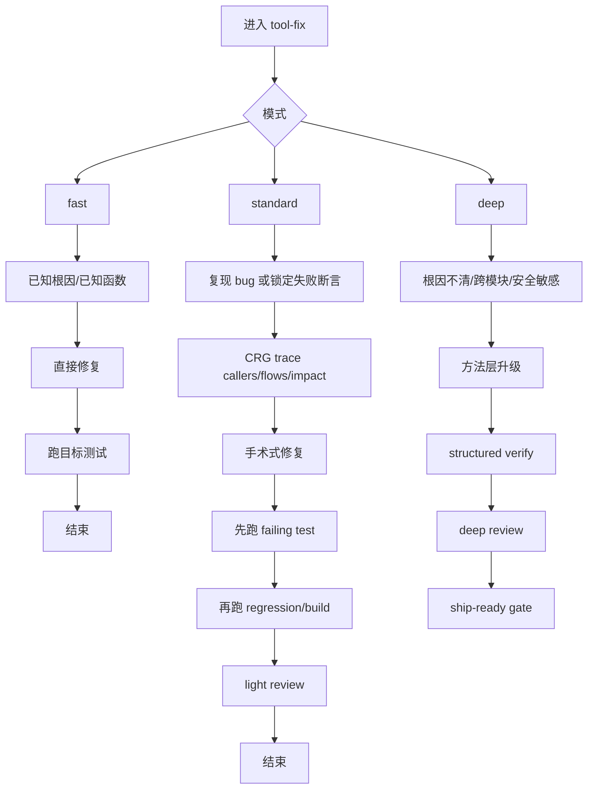

路径说明：

- `--fast`：适合“知道哪坏了”的修补
- `--standard`：适合正常排查路径，默认应该停留在本地可证明范围
- `--deep`：只在 flaky、跨模块、系统性问题、安全问题时启用

### `tool-feat`

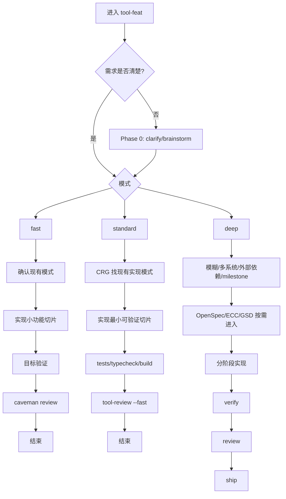

路径说明：

- `Phase 0` 不是额外负担，而是避免在需求模糊时直接编码
- `--standard` 是最关键主路径：找模式、做最小切片、跑原生验证、轻审查
- `--deep` 才引入更重的规格层和编排层

### `tool-plan`

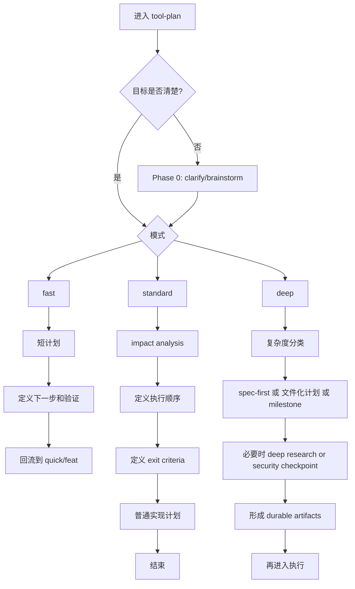

路径说明：

- `--fast`：只是给小任务补一个足够执行的短计划
- `--standard`：解决“顺序、范围、验收不清”的普通规划问题
- `--deep`：当 planning 已经升级为 spec、文件化计划、milestone 管理问题时才使用

---

## 支持命令内部分流小图

### `tool-review`

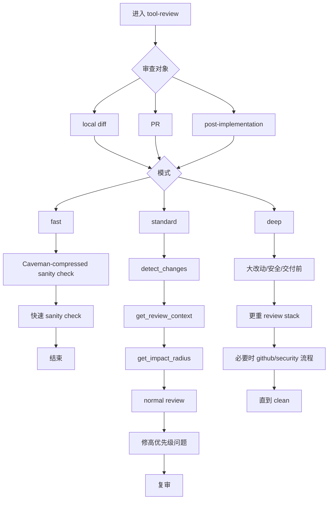

路径说明：

- `--fast`：适合“小 diff 看一眼”的低成本审查
- `--standard`：默认 PR / diff 审查路径，图谱辅助是核心
- `--deep`：适合大改动、发布前、安全敏感场景

### `tool-refactor`

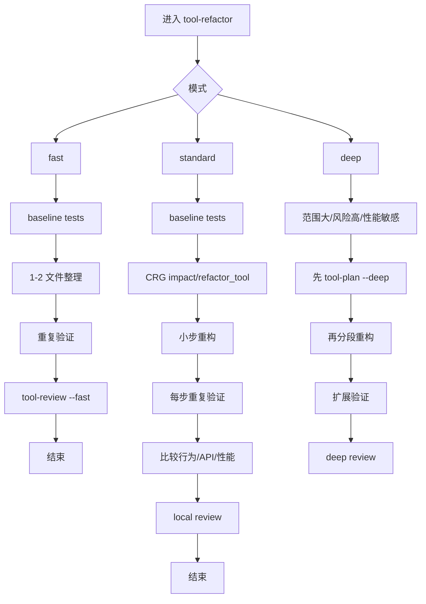

路径说明：

- `--fast`：只适合非常小的行为保持重构
- `--standard`：baseline -> 小步重构 -> 每步验证 是主路径
- `--deep`：先规划，再重构，避免把大规模整理直接做成无计划改动

### `tool-research`

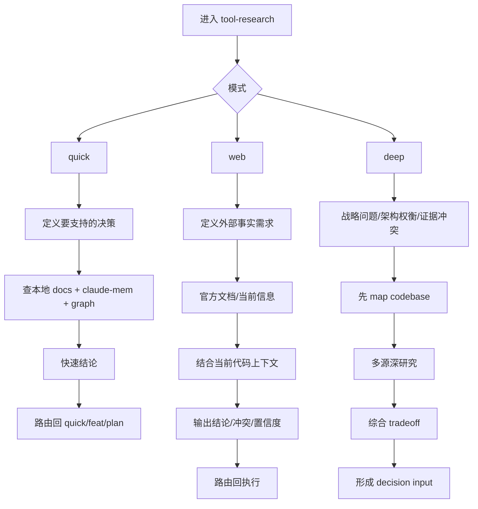

路径说明：

- 这个命令不是 `fast/standard/deep`，而是 `quick/web/deep`
- `--quick` 优先回答本地能回答的问题
- `--web` 解决需要最新事实或官方资料的问题
- `--deep` 才用于策略研究和架构权衡

---

## 平台命令动作分流小图

这 3 个命令不是靠成本模式分流，而是靠“平台动作类型”分流。

### `tool-branch`

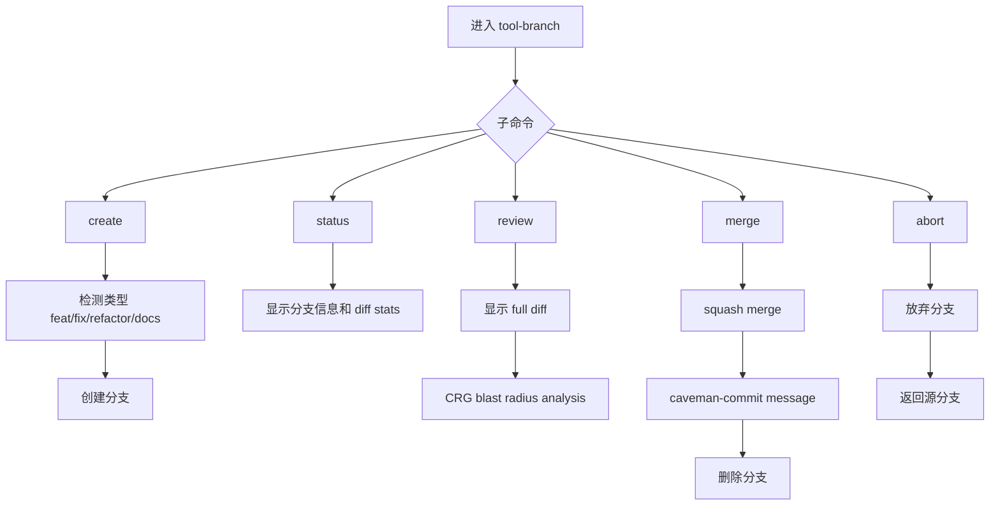

路径说明：

- `create/status/review/merge/abort` 是生命周期动作，不是成本模式
- `review` 是这里唯一自然变“稍重”的子命令，因为它会接 diff 和 blast radius

### `tool-graph`

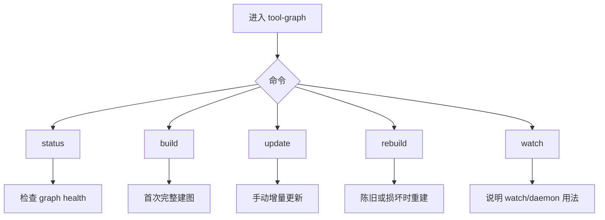

路径说明：

- 日常开发不应该手动先跑它
- 它的定位是 graph 的诊断和维护入口
- 真正的业务命令会自动使用 graph

### `tool-update`

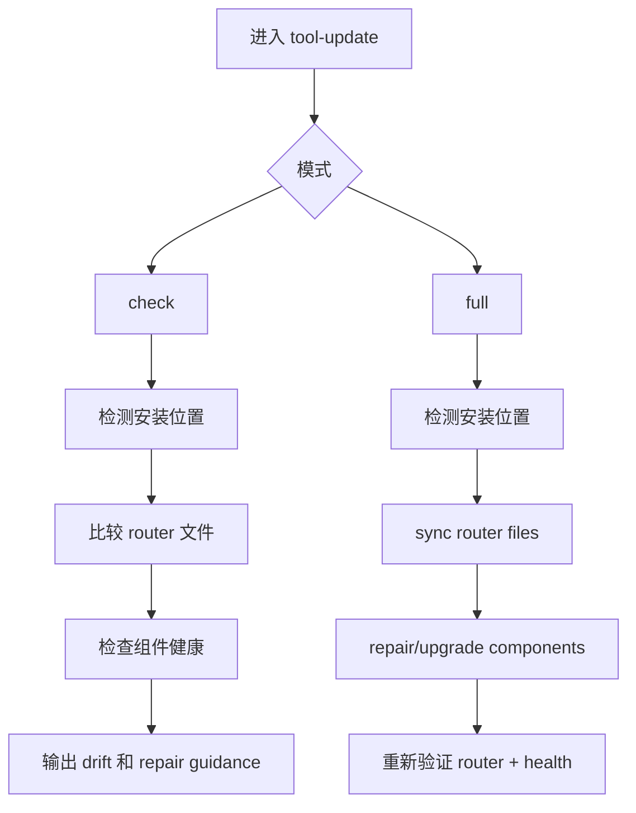

路径说明：

- `--check`：读状态，不改东西，给出 drift 和修复建议
- `--full`：先处理 router 层，再处理 component 层
- 这也是整个项目推荐记忆的唯一更新入口

---

## 10 个命令的分流一览

| 命令 | 分流轴 |
|---|---|
| `tool-quick` | `--fast / --standard` |
| `tool-fix` | `--fast / --standard / --deep` |
| `tool-feat` | `--fast / --standard / --deep` |
| `tool-plan` | `--fast / --standard / --deep` |
| `tool-review` | `--fast / --standard / --deep` |
| `tool-refactor` | `--fast / --standard / --deep` |
| `tool-research` | `--quick / --web / --deep` |
| `tool-branch` | `create / status / review / merge / abort` |
| `tool-graph` | `status / build / update / rebuild / watch` |
| `tool-update` | `--check / --full` |

---

## 路由规则

### 先选命令

- 小改动：`tool-quick`
- Bug/回归：`tool-fix`
- 新功能：`tool-feat`
- 范围、顺序、验收不清：`tool-plan`
- 审查本身是任务：`tool-review`
- 研究本身是任务：`tool-research`
- 平台动作：`tool-branch`、`tool-graph`、`tool-update`

### 再选模式

- 能在最小上下文下做对：`--fast`
- 正常工程开发：`--standard`
- 明显跨系统、高风险、需要规格或编排：`--deep`

### 再决定是否升级能力层

- 需要单任务方法升级：`superpowers`
- 需要专项能力库：`ECC`
- 需要持久化 spec：`OpenSpec`
- 需要多阶段编排：`GSD`

---

## 一句话总结

Engineer Shovel 现在的全局路由是：

```text
命令 = 做什么
模式 = 做到多重
外部工具 = 何时升级能力层
```

如果一个任务在 `quick/fix/feat/plan` 的 `--standard` 内就能正确完成，就不该默认升级到更重层。
